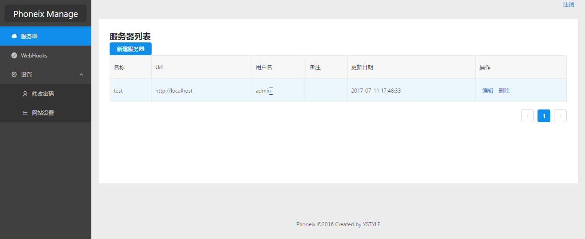
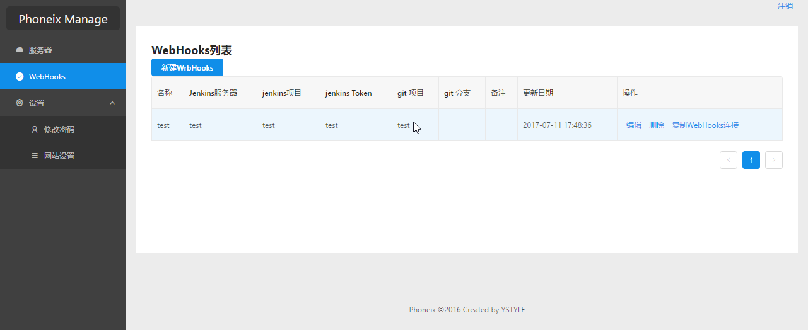

## WebHooks Manage


### Introduction
Phoneix is a proxy for git server for jenkins. like github, gitlab, gogs, gitee etc.

### feature
- Multiple jenkins server
- Jenkins's login user and token
- git project and jenkins project validate
- has a Handsome web app for manage jenkins server and WebHooks

### Install

[download](https://github.com/ystyle/phoneix/releases/)

```shell
$ ./phoneix -h
NAME:
   glide - proxy git server's webhooks for jenkins

USAGE:
   phoneix [global options] command [command options] [arguments...]

VERSION:
   1.0.0

COMMANDS:
     init, i    Initialize config file , local dataset .
     server, s  start sever.
     help, h    Shows a list of commands or help for one command

GLOBAL OPTIONS:
   --config value, -c value  use custom config file, it's a json file. (default: "./phoneix.json")
   --help, -h                show help
   --version, -v             print the version

$  ./phoneix init # init config file
$  ./phoneix server # start server
```

>then open [127.0.0.1:8080](http://127.0.0.1:8080) on chrome browser. and default the username/password is admin admin123. you can config it in `phoneix.json` or  `init command`

### screenshot



